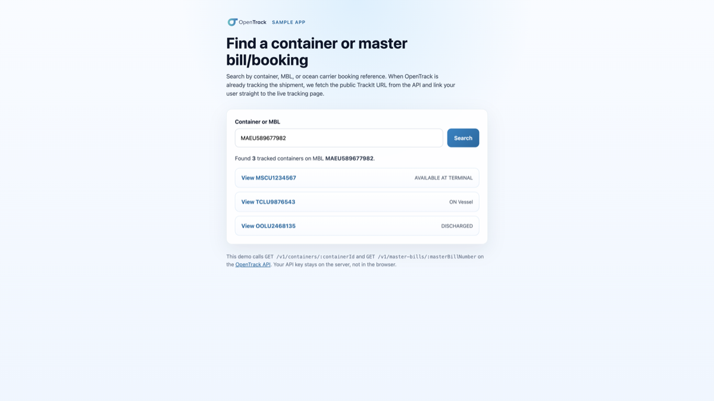

# OpenTrack sample apps

Starter projects you can clone and remix to integrate with the [OpenTrack API](https://developers.opentrack.co/docs/getting-started).

## Samples

| App | Description |
| --- | --- |
| [`public-tracking-search`](./public-tracking-search/) | React + TypeScript search page that returns live tracking links for a container, MBL, or booking |

## License

MIT. See [LICENSE](./LICENSE).
